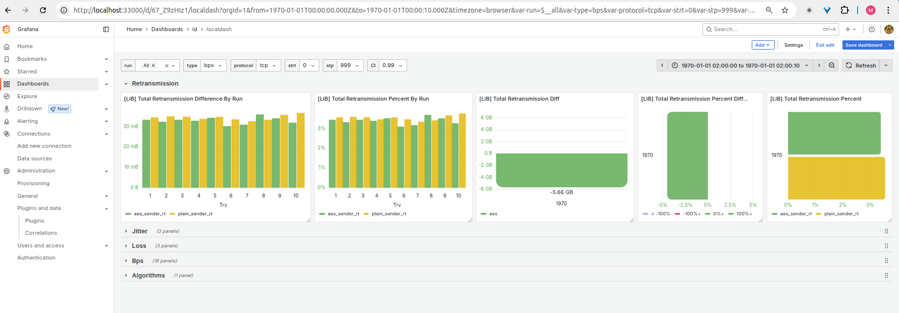

# Wireguard with AES Support

WireGuard, a high-performance VPN integrated into the Linux kernel, is renowned
for its speed and reliance on software-based encryption. However, it faces
limitations as a VPN Gateway (VPNGW), particularly in software-defined networks
(SDNs), where its throughput drops significantly with multiple client
connections and hardware encryption remains underutilized. This study presents
an enhanced WireGuard implementation that incorporates AES encryption with
hardware acceleration to boost efficiency. Using kernel-based AES results in an
11% increase in throughput, a 5.5% decrease in retransmissions, and a 10%
reduction in CPU usage. Meanwhile, user-space AES (implementation
[[here](https://github.com/mfyuce/boringtun/tree/registry-trait-with-fast)] )
can deliver up to 19.47% higher throughput on modern CPUs, achieving
terabit-per-second speeds and greater efficiency with larger MTUs.

## Building

**More information may be found at
[WireGuard.com](https://www.wireguard.com/).**

## License

This project is released under the [GPLv2](COPYING).

## TEST

```bash
cd run
./test_generic_single.sh <how_many_tunnels>
```

# Charts

```bash
cd experimentation/experiment_archieve
cat aes.tar.xz.part.* > aes.tar.xz
tar -xf aes.tar.xz
mv aes ../

cat chacha.tar.xz.part.* > chacha.tar.xz
tar -xf chacha.tar.xz
mv chacha ../

docker compose up
```

After all dockers started, to insert all the experimentation output to DB;

```python
python3 ./pg.py
```

## Grafana

```python
http://localhost:33000/d/67_Z9zHIz1/localdash?orgId=1&
```


